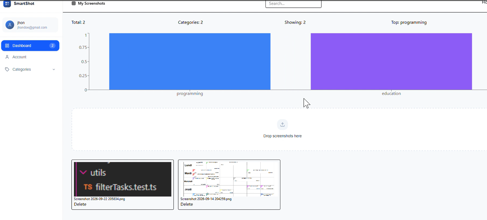
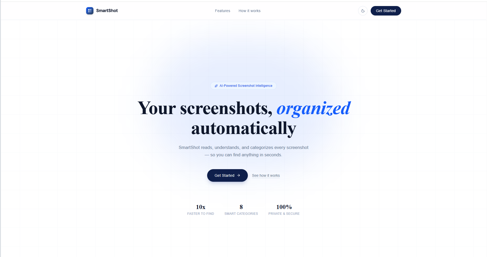
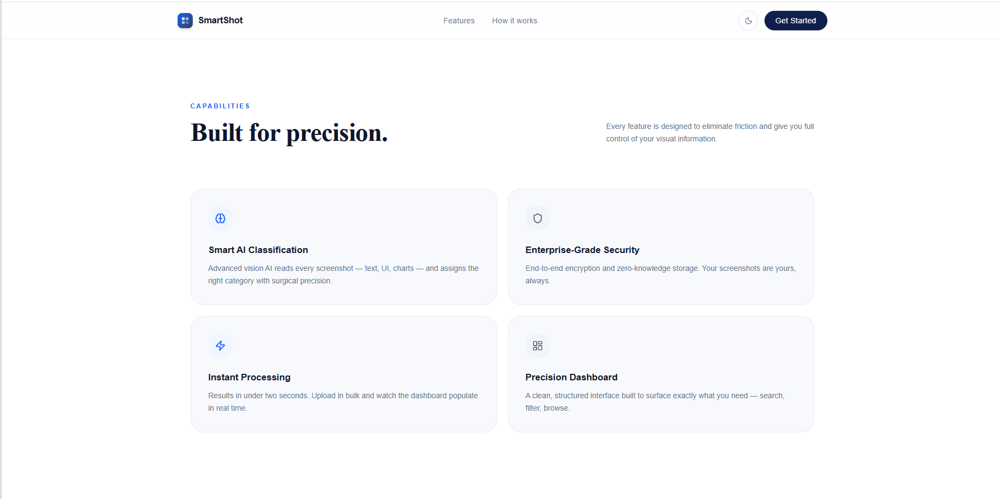
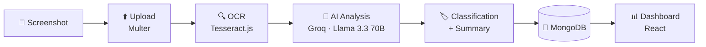

<div align="center">

# 🎯 SmartShot

### Capture. Understand. Organize.

**A full-stack web app that turns screenshots into searchable, classified, summarized knowledge — using OCR and LLM analysis.**

[🚀 Live Demo](https://smartshot-web.onrender.com/) · [📦 Repository](https://github.com/eya-gassab/smartshot-fullstack-project) · [🐛 Report a Bug](https://github.com/eya-gassab/smartshot-fullstack-project/issues)


</div>

<table>
  <tr>
    <td align="center">
      
    </td>
    <td align="center">
      
    </td>
    <td align="center">
      
    </td>
  </tr>
</table>

---

## 📑 Table of Contents

- [Why SmartShot?](#-why-smartshot)
- [Features](#-features)
- [How It Works](#-how-it-works)
- [Tech Stack](#️-tech-stack)
- [Getting Started](#-getting-started)
- [API Reference](#-api-reference)
- [Deployment](#️-deployment)
- [Contributors](#-contributors)
- [License](#-license)

---

## 💡 Why SmartShot?

Screenshots pile up fast, and their content — error messages, receipts, notes, code, conversations — is locked inside pixels. You can't search it, sort it, or quickly recall what it was.

SmartShot fixes that. Upload an image and it automatically:

1. **Extracts** the text with OCR,
2. **Understands** it with an LLM,
3. **Classifies** it and writes a short summary,
4. **Stores** everything in your private, searchable dashboard.

---

## ✨ Features

|     | Feature                 | Description                                            |
| --- | ----------------------- | ------------------------------------------------------ |
| 📸  | **Upload & manage**     | Add screenshots and keep them in one place             |
| 🔍  | **Automatic OCR**       | Text extracted from every image with Tesseract.js      |
| 🤖  | **AI analysis**         | Content interpreted by Llama 3.3 70B via the Groq API  |
| 🏷️  | **Auto-classification** | Each screenshot is categorized by its content          |
| 📝  | **Smart summaries**     | Concise, human-readable summary per screenshot         |
| 🔐  | **Secure auth**         | JWT-based authentication with bcrypt-hashed passwords  |
| 👤  | **Private by user**     | Every user sees and manages only their own screenshots |
| 🗑️  | **Full control**        | Delete stored screenshots at any time                  |
| 📱  | **Responsive UI**       | Works on desktop and mobile                            |

---

## 🔄 How It Works



---

## 🛠️ Tech Stack

| Layer        | Technologies                                         |
| ------------ | ---------------------------------------------------- |
| **Frontend** | React 19, TypeScript, Vite, CSS                      |
| **Backend**  | Node.js, Express.js, Multer (uploads), JWT, bcryptjs |
| **Database** | MongoDB, Mongoose                                    |
| **AI / OCR** | Tesseract.js, Groq API, Llama 3.3 70B                |

---

## 🚀 Getting Started

### Prerequisites

- [Node.js](https://nodejs.org/) 18+
- A [MongoDB](https://www.mongodb.com/) database (local or Atlas)
- A [Groq API key](https://console.groq.com/)

### 1. Clone the repository

```bash
git clone https://github.com/eya-gassab/smartshot-fullstack.git
cd smartshot-fullstack
```

### 2. Install dependencies

```bash
# Root (provides the single-command dev script)
npm install

# Backend
cd backend
npm install

# Frontend
cd ../frontend
npm install

cd ..
```

### 3. Configure environment variables

Copy the provided `.env.example` files, then fill in your values.

**`backend/.env`**

```env
PORT=5000
MONGO_URI=your_mongodb_connection_string
JWT_SECRET=your_secure_jwt_secret
GROQ_API_KEY=your_groq_api_key
FRONTEND_URL=http://localhost:5173
```

**`frontend/.env`**

```env
VITE_API_URL=http://localhost:5000
```

> ⚠️ **Never commit real `.env` files or API keys.** Make sure `.env` is listed in your `.gitignore`.

### 4. Run the app

From the project root, one command starts both the backend and the frontend:

```bash
npm run dev
```

| Service  | URL                   |
| -------- | --------------------- |
| Frontend | http://localhost:5173 |
| Backend  | http://localhost:5000 |

---

## 🔌 API Reference

Routes marked 🔒 require a valid JWT in the `Authorization: Bearer <token>` header.

### Authentication

| Method | Endpoint                    | Description              | Auth |
| ------ | --------------------------- | ------------------------ | :--: |
| `POST` | `/api/auth/register`        | Create an account        |  —   |
| `POST` | `/api/auth/login`           | Log in and receive a JWT |  —   |
| `POST` | `/api/auth/update-email`    | Update account email     |  🔒  |
| `POST` | `/api/auth/update-password` | Update account password  |  🔒  |

### Screenshots

| Method   | Endpoint                  | Description                                  | Auth |
| -------- | ------------------------- | -------------------------------------------- | :--: |
| `POST`   | `/api/screenshots/upload` | Upload a screenshot (runs OCR + AI analysis) |  🔒  |
| `GET`    | `/api/screenshots`        | List the current user's screenshots          |  🔒  |
| `DELETE` | `/api/screenshots/:id`    | Delete a screenshot                          |  🔒  |

### Health

| Method | Endpoint | Description         |
| ------ | -------- | ------------------- |
| `GET`  | `/`      | Server health check |

---

## ☁️ Deployment

The live demo is hosted at **[smartshot-final.onrender.com](https://smartshot-web.onrender.com/)**.

| Component | Build |
|---|---|
| Frontend | Static Vite production build (`npm run build`) |
| Backend | Node.js / Express server |
| Database | MongoDB |
| AI | Groq API |

For production, set all environment variables through your hosting platform's dashboard — never in the repository.

---

## 👥 Contributors

SmartShot was built collaboratively, covering frontend, backend, database, and AI integration.

|     | Name                                                |
| --- | --------------------------------------------------- |
| 👩‍💻  | **[Eya Gassab](https://github.com/eya-gassab)**     |
| 🤝  | **[Asma Mokadem](https://github.com/Asma-mokadem)** |

---

## 📄 License

This project is intended for educational and portfolio purposes.
